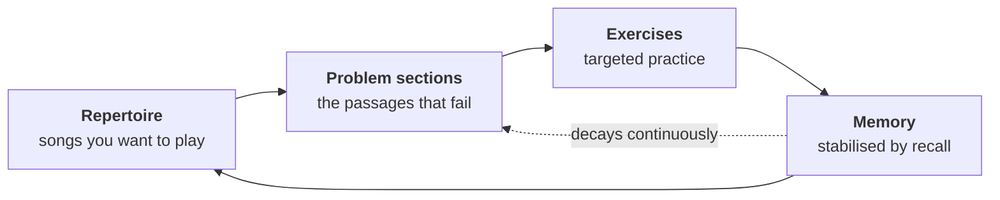

Nothing in that image is decorative. The instruments span 2,500 years, the
automata are Hephaestus's, the gesture is older than the music it now belongs
to, and the couplet on the sign is this project's pipeline in order.
<a href="https://github.com/mnemosys-project/.github/blob/develop/docs/branding/banner-design.md"><b>The design record</b></a>
explains it hinge by hinge — and logs all eight generations it took to get
there.

# Mnemosys Project

**Tools for learning to play the songs you want to play — and for still being
able to play them a year from now.**

## Table of Contents

- [The problem](#the-problem)
- [What this is](#what-this-is)
- [Where it came from](#where-it-came-from)
- [The tools](#the-tools)
- [How it works](#how-it-works)
- [Status](#status)
- [Why the names](#why-the-names)
- [Documentation](#documentation)
- [Contributing](#contributing)

## The problem

You learn a song. You get it under your fingers, play it for a few weeks, and
move on to the next one. Six months later you sit down to play it and three
passages are gone. You didn't notice them going.

Meanwhile practice time is finite, and most of it quietly drifts toward the
things you already play well, because those are the things that feel good to
play. The passages that actually need work are the ones you avoid.

And when you do sit down to fix something, there's a gap that nothing bridges.
You know *which song* is failing. You don't know *which exercise* repairs it.
"Play it slower" is advice, not a plan.

Most practice systems are built for **acquisition** — new material, new
techniques, new challenges. Acquisition is not the hard problem.

**Retention is.** Advanced skills decay quietly, unevenly, and relentlessly
unless they are actively maintained. Relearning what you once had is expensive
and demoralising, and it is usually mistaken for a failure of discipline rather
than what it actually is: a predictable property of human memory.

## What this is

Mnemosys treats a repertoire as a **portfolio of skills that decay**, and
practice as the maintenance schedule that keeps them alive.

You keep a repertoire. Inside each piece are specific passages you cannot play
yet, or could play once and are quietly losing. Those passages — not the songs
— are the atomic unit of work, and they are what determines which exercises you
practise. Practising them stabilises the memory. Stable memory is what lets you
actually perform the song rather than approximately remember it. And everything
in the repertoire is decaying the entire time, which is why the loop never
terminates.

That is the whole idea. Everything else in this organization is machinery for
running that loop honestly, on a schedule, without relying on how you happen to
feel on a given morning.

## Where it came from

The training ideas behind this project are my bass instructor's. The software is
an attempt to make them repeatable.

A first version in February 2026 got as far as SQLAlchemy, Alembic, FastAPI and
an AWS deployment — and never generated a single practice sheet. It was set
aside, not because the thinking was wrong but because the infrastructure ate the
project.

This organization is the revival, built deliberately small: standalone
command-line tools, no database, no API, no cloud. The domain thinking carried
over intact. Everything else was thrown away.

## The tools

| Tool | Say it | Status | What it does |
| --- | --- | --- | --- |
| **`melete`** | MEL-uh-tee | In development | Generates daily practice sheets. Parameterised exercises rendered to standard notation and tablature via LilyPond, with deliberate variety across sessions. |
| **`aoede`** | ay-EE-dee | Reserved | Repertoire management. Acquisition, decay modelling, and maintenance scheduling for learned material. |

Names are claimed the moment a tool is conceived, not when work begins — so they
are not rediscovered later and argued about.

## How it works

This section describes the design of the full system. See
[Status](#status) for what actually exists today.

**Exercises are abstract; instruments are configurations.** An exercise
describes string indices, fret distances and interval relationships. Nothing
hardcodes bass, or a string count, or a tuning. Bass is a configuration, not a
special case.

**Progression is explicit and orthogonal.** Difficulty is not a single number.
It is a set of independent dimensions — tempo and subdivision, range and string
topology, pattern complexity, rhythmic displacement, constraint stacking,
endurance. One knob moves at a time, so you always know what changed.

**Generation is deterministic and explainable.** The same inputs produce the
same session, and the system can say why every exercise appeared. There is no
machine learning anywhere in the design, and none is wanted — an unexplainable
practice plan is not a practice plan.

**Fatigue is a first-class constraint.** Work is tagged by how expensive it is
mechanically and cognitively. Warmups are mandatory before heavy work, heavy
blocks cannot be adjacent, and application always comes last.

**Repertoire is a portfolio under decay.** Pieces occupy states — acquiring,
fragile, stable, legacy — and carry decay rates measured in days. Maintenance is
scheduled before acquisition, because cheap maintenance beats heroic
relearning. The cheapest intervention that will do the job is always preferred:
a two-minute memory probe before a section refresh, a section refresh before a
full run-through.

**Instructor judgement is encoded, not replaced.** The system exists to stop
good heuristics from being forgotten or applied inconsistently. It is not trying
to be a better teacher than a teacher.

## Status

The organization is new and bootstrapping. Work is tracked as epics in this
repository.

| | |
| --- | --- |
| **`melete`** | In development. First tool. |
| **`aoede`** | Reserved. Not started. |

**What `melete` does today:** generates a printable daily practice sheet —
parameterised exercises, rendered to notation and tablature, selected with
deliberate variety and a session log.

**What `melete` does not do:** it has no decay model, no fatigue state, no
repertoire, and no memory of what you played yesterday beyond that log. The
retention machinery described above is where this is going, not where it is. The
first tool deliberately inherited the domain thinking from the earlier project
and left the state model behind.

That distinction matters enough to state plainly: this organization is named for
a problem it has not solved yet.

## Why the names

The organization is named for memory. Each tool under it is named for a Muse.

This is not decoration. The Muses are the daughters of Mnemosyne — memory
herself — so a scheme in which the organization is memory and its tools are her
daughters is structurally true to the domain rather than merely thematic. Every
tool this project builds is a particular faculty descending from memory.

An older Boeotian tradition, recorded by Pausanias, names only three Muses,
worshipped on Mount Helicon. All three map onto this project's concerns.

| Muse | Say it | Domain | Here |
| --- | --- | --- | --- |
| **Mneme** (Μνήμη) | NEE-mee | memory | The organization itself |
| **Melete** (Μελέτη) | MEL-uh-tee | practice, study | Practice exercise generation |
| **Aoede** (Ἀοιδή) | ay-EE-dee | song | Repertoire — acquisition and retention |

*Melete* does not mean "practice" loosely. It means deliberate, effortful study
— recall under constraint. That is precisely the thing this project exists to
describe.

> **Practice becomes memory. Memory becomes song.**

That couplet is the loop above, in order: **Melete → Mneme → Aoede.**

## Documentation

- [**Naming convention**](https://github.com/mnemosys-project/.github/blob/develop/NAMING.md)
  — the authoritative scheme, the full Muse roster with availability, the rules,
  and the primary sources. Read this before naming anything.
- [**Banner design record**](https://github.com/mnemosys-project/.github/blob/develop/docs/branding/banner-design.md)
  — what the image at the top means, hinge by hinge, plus the full generation
  log and what it taught us about specifying images.
- [**Epics**](https://github.com/mnemosys-project/.github/tree/develop/epics)
  — specifications and implementation plans for work in flight.

## Contributing

See [CONTRIBUTING.md](https://github.com/mnemosys-project/.github/blob/develop/CONTRIBUTING.md).
